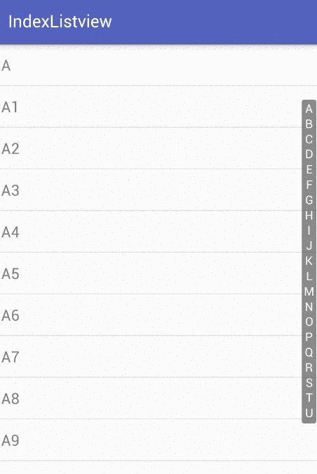

#IndexableExpandableListView
相信大家都看过IOS的TableView字母快速索引功能,如果列表数据比较多,快速索引确实非常好用。而且IOS的TableView设置索引非常方便,只需要返回一个分组数组即可。反观Android并没有这么方便的控件，于是便自己写了一个。   

本项目的发布离不开[https://github.com/woozzu/IndexableListView](https://github.com/woozzu/IndexableListView)，在此非常感谢作者的分享。

相对于原项目，本项目进行了一些定制化,可以对侧边栏进行一些定制，甚至，可以做高级的定制。

有问题可以在issue提出,或者到[我的博客](http://wiyi.org)留言



#功能说明

* 快速索引功能
* 支持设置字体大小、背景颜色，透明度等。
* 可以设置自己的画笔(如果需要)

#属性说明  
> indexbarFontSize 索引栏内部文字大小(索引栏宽度由字体大小决定)   
> indexbarAlpha 索引栏和预览框的透明度,如果为0,预览框不会被绘制   
> indexbarPadding 索引栏的内边距   
> indexbarMargin 索引栏右边的距离   
> indexbarTextColor 字体颜色   
> showPreview 是否显示预览框   


#示例
1. 在XML中使用  

``` xml 
<org.wiyi.indexablelistview.IndexableExpandableListView
	    xmlns:android="http://schemas.android.com/apk/res/android"    
	    xmlns:app="http://schemas.android.com/apk/res-auto"   
	    android:id="@+id/indexer"    
	    android:layout_width="match_parent"   
	    android:layout_height="match_parent"   
	    android:groupIndicator="@null"   
	    app:showPreview="false"/> 
```
``` java
// 1.先写一个Adapter继承 IndexableListAdapter,然后返回分组列表即可

public class MyAdapter extends IndexableListAdapter {

    @Override
    public String[] getSections() {
        String[] sections = new String[group.size()];
        return group.toArray(sections);
    }
}  


//2. 调用setIndexableAdapter来设置Adapter
listView.setIndexableAdapter(adapter);

```


#联系方式
###Email: palinty[at]gmail.com
###blog: [http://wiyi.org](http://wiyi.org)

## License

    Copyright 2011-2015 Sergey Tarasevich

    Licensed under the Apache License, Version 2.0 (the "License");
    you may not use this file except in compliance with the License.
    You may obtain a copy of the License at

       http://www.apache.org/licenses/LICENSE-2.0

    Unless required by applicable law or agreed to in writing, software
    distributed under the License is distributed on an "AS IS" BASIS,
    WITHOUT WARRANTIES OR CONDITIONS OF ANY KIND, either express or implied.
    See the License for the specific language governing permissions and
    limitations under the License.